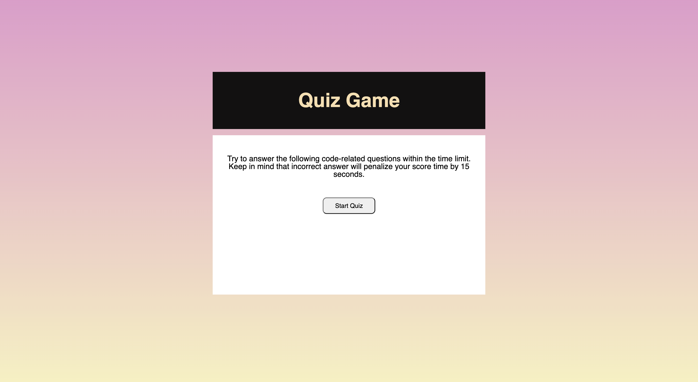

<h1>Assignment04-Test-Your-Knowledge</h1>

This assignment is about creating a quiz webpage

<ol>
<li>There are 10 questions in total</li>
<li>Once you answer them all you will be able to see the score</li>
</ol>

<h2>Pending Tasks</h2>
<ol>
<li>I am partially submitting the project as the timer doesn't work as expected</li>
<li>Also the screen to enter the initials doesn't work yet</li>
<li>The code is written but still it doesn't work</li>
<li>Note: I will be resubmitting the project again</li>
</ol>

<h3>Link of Github</h3>

https://github.com/rimadas9878/Assignment04-Test-Your-Knowledge

<h3>Link of Website</h3>

https://rimadas9878.github.io/Assignment04-Test-Your-Knowledge/

<h3>Image of the prompt messages</h3>
